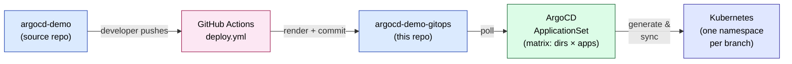

# argocd-demo-gitops

Single source of truth ArgoCD watches. **CI in [erchetansoni/argocd-demo](https://github.com/erchetansoni/argocd-demo) is the only thing that writes to this repo.** Don't edit `environments/<branch>/` by hand — your changes will be wiped on the next push to a branch in the source repo.

This is the *output* side of the GitOps pipeline. The *input* (app code, Helm chart, raw manifests, CI workflow definitions) lives in the source repo.

---

## How this repo gets used



---

## Layout

```
.
├── _source/                          # submodule -> argocd-demo (advanced by CI to source HEAD)
├── applicationset.yaml               # the only ApplicationSet (applied once at setup)
├── argocd-cm-patch.yaml              # one-time argocd-cm patch (enables kustomize buildOptions)
└── environments/
    └── <branch>/                     # one folder per branch, written by CI
        ├── app1/
        │   ├── kustomization.yaml    # helmGlobals.chartHome -> ../../../_source/apps
        │   └── values.yaml           # per-env Helm values
        ├── app2/
        │   └── kustomization.yaml    # resources -> ../../../_source/apps/app2 + ingress patch
        └── app3/
            └── kustomization.yaml    # same shape as app2
```

See [environments/README.md](environments/) for the full per-env contract.

---

## How a single Application gets rendered

ArgoCD's ApplicationSet generates one Application per **(env × app)** combination — e.g. `qa-app1`, `qa-app2`, `qa-app3`. Each Application's source path is `environments/<branch>/<app>/`. Kustomize then resolves the chart/manifests via the `_source` submodule.

| Application | Path read by ArgoCD | What it deploys |
|---|---|---|
| `<branch>-app1` | `environments/<branch>/app1/` | Helm chart from `_source/apps/app1`, values from local `values.yaml` |
| `<branch>-app2` | `environments/<branch>/app2/` | Raw manifests from `_source/apps/app2`, ingress host patched per branch |
| `<branch>-app3` | `environments/<branch>/app3/` | Raw manifests from `_source/apps/app3`, ingress host patched per branch |

All three Applications for one branch deploy into a single namespace named after the branch.

---

## Submodule semantics

The `_source` submodule is bumped to the source-repo `GITHUB_SHA` on every CI run (see the source repo's [`.github/workflows/deploy.yml`](https://github.com/erchetansoni/argocd-demo/blob/main/.github/workflows/deploy.yml)). The pointer is **global across all envs** — every Application sees the same source state. If two pushes happen in close succession on different branches, last-write-wins for the submodule pointer.

For a demo this is fine. For per-branch source pinning, swap the ApplicationSet for a [multi-source](https://argo-cd.readthedocs.io/en/stable/user-guide/multiple_sources/) pattern with `targetRevision` per env.

### Manually bumping the submodule

Almost never needed (CI does this), but if you need to refresh against source main:

```bash
git submodule update --remote _source
git add _source
git commit -m "chore: bump _source [skip ci]"
git push
```

---

## ApplicationSet config

This repo holds the canonical [`applicationset.yaml`](applicationset.yaml) so anyone setting up a fresh cluster can `kubectl apply -f` it directly. The shape is a **matrix generator** combining:

- A **git directory generator** over `environments/*` (one entry per branch).
- A **list generator** with `app1`, `app2`, `app3`.

Result: `directories × apps` Applications. New branch in source repo → new directory here → 3 new Applications appear automatically. Branch deleted → 3 Applications and their resources auto-prune.

---

## Initial bootstrap (one-time)

```bash
git clone git@github.com:erchetansoni/argocd-demo-gitops.git
cd argocd-demo-gitops

# Add the source repo as a submodule
git submodule add -b main https://github.com/erchetansoni/argocd-demo.git _source

# Drop in applicationset.yaml + argocd-cm-patch.yaml (already in this repo).
git add .
git commit -m "chore: bootstrap gitops repo [skip ci]"
git push -u origin main

# Apply the ApplicationSet once to the cluster.
kubectl apply -f applicationset.yaml
```

After this, the source repo's CI does all subsequent writes. You should never need to clone this repo again unless debugging.

---

## Files you can safely edit

| File | Editable? | Notes |
|---|---|---|
| `applicationset.yaml` | ✅ Yes | When you add/remove apps or change destination cluster. Re-`kubectl apply` after pushing. |
| `argocd-cm-patch.yaml` | ✅ Yes | One-time cluster config. Hand-applied. |
| `README.md` (this file) | ✅ Yes | Docs. |
| `_source` submodule pointer | ⚠️ Rarely | CI bumps it. Manual bump only when source repo branches diverge. |
| `environments/<branch>/**` | ❌ Never | Owned by CI. Edits will be overwritten. |